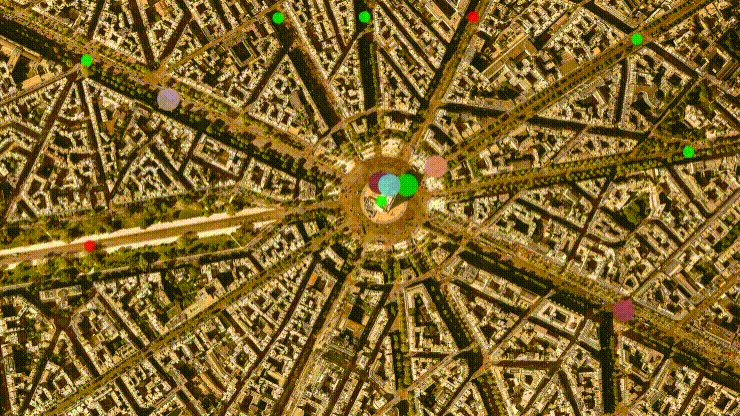

# Traffic Simulation

## Features
* Contains several "cars" represented as colorfull circles on a Map.
* These "cars" drive arround in the city independently from each other using concurrency.
* They stop at certain points with traffic lights and drive only when it is green.

## Dependencies for Running Locally
* cmake >= 2.8
  * All OSes: [click here for installation instructions](https://cmake.org/install/)
* make >= 4.1 (Linux, Mac), 3.81 (Windows)
  * Linux: make is installed by default on most Linux distros
  * Mac: [install Xcode command line tools to get make](https://developer.apple.com/xcode/features/)
  * Windows: [Click here for installation instructions](http://gnuwin32.sourceforge.net/packages/make.htm)
* OpenCV >= 4.1
  * The OpenCV 4.1.0 source code can be found [here](https://github.com/opencv/opencv/tree/4.1.0)
* gcc/g++ >= 5.4
  * Linux: gcc / g++ is installed by default on most Linux distros
  * Mac: same deal as make - [install Xcode command line tools](https://developer.apple.com/xcode/features/)
  * Windows: recommend using [MinGW](http://www.mingw.org/)

## Running the application

1. Clone repo
1. Go to folder `Traffic-Simulation`
2. Run `make build`
3. `cd build`
4. `./traffic_simulation`

## Additional Commands from Makefile

* `make debug` -> builds with debug information
* `make format` -> runs [clangFormat](https://clang.llvm.org/docs/ClangFormat.html) on project
* `make clean` -> deletes build folder
* `make memcheck` -> builds app and runs it with [valgrind](https://www.valgrind.org/)

## License

This project is licensed under the MIT License - see the [LICENSE.md](LICENSE.md) file for details